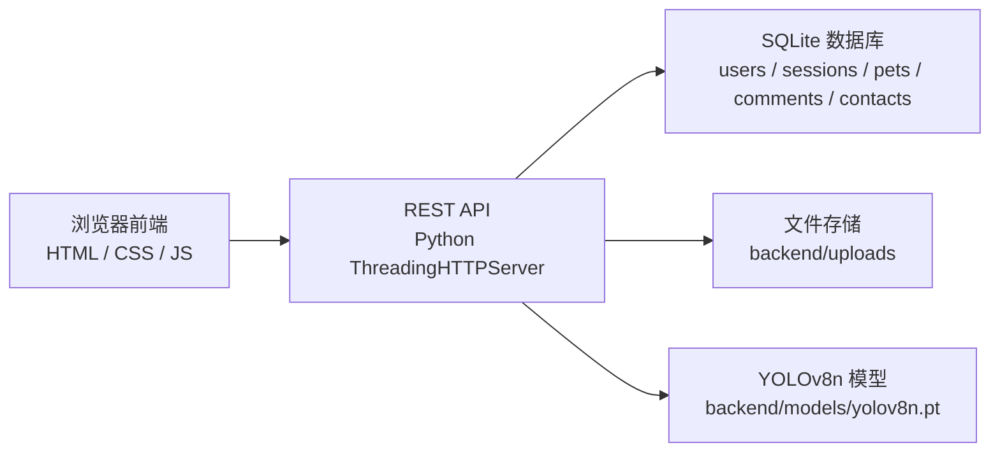

# 宠物归家系统 Pet Homecoming

## 1. 项目概述

宠物归家系统是一个面向流浪宠物救助、失宠寻回、领养发布与信息审核场景的前后端分离式 Web 系统。项目以“低门槛部署、可快速演示、具备视觉识别能力”为目标，提供了用户注册与审核、宠物建档发布、宠物信息浏览、评论与联系申请、管理员审核，以及基于 YOLO 的宠物类别即时识别功能。

当前版本采用轻量化技术路线：

- 前端使用原生 HTML、CSS、JavaScript 构建多页面界面。
- 后端使用 Python 标准库 `ThreadingHTTPServer` 提供 REST 风格接口。
- 数据持久化使用 SQLite。
- 图像处理使用 Pillow。
- 宠物目标识别使用 Ultralytics YOLOv8n。

该实现适合作为毕业设计、课程设计、系统原型验证或论文中的“设计与实现”部分样例，也便于后续扩展为更完整的宠物公益平台。

## 2. 系统目标

本系统围绕以下目标设计：

- 为宠物救助、招领、寻主、领养等场景提供统一的信息发布与浏览入口。
- 为注册用户提供基础身份信息录入与审核机制。
- 为管理员提供用户资料审核能力，保证平台信息可信度。
- 为宠物发布流程加入图像识别能力，在本地上传图片后即时判断宠物大类。
- 为后续论文扩展预留清晰的系统结构、数据库结构与算法接入位置。

## 3. 当前版本已实现功能

### 3.1 用户与权限

- 用户注册：支持用户名、密码、姓名、手机号，并可填写邮箱、地址、证件号。
- 用户登录：当前版本采用“用户名 + 密码”登录。
- 会话管理：登录成功后创建随机 token，会话记录存入 `sessions` 表，前端通过 `Authorization: Bearer <token>` 调用接口。
- 人员审核：普通用户注册后默认为 `pending` 状态，管理员可执行 `approved` 或 `rejected` 审核。
- 权限控制：管理员可查看待审核人员并执行审核；未登录用户不能发布宠物、评论或发起联系；当前版本中，未审核通过用户不能登录系统。

### 3.2 宠物发布与识别

- 支持本地图片上传。
- 支持浏览器摄像头拍照采集图片。
- 前端会生成原图与轻量增强后的预览图。
- 上传本地图片或拍照后，前端立即调用后端 YOLO 接口进行识别。
- 系统会将识别结果自动填入“分类”字段，分类范围为：
  - `犬类`
  - `猫类`
  - `鸟类`
  - `其他`
- 若 YOLO 未检测到猫、狗、鸟，则自动归类为“其他”。
- 用户仍需补充宠物名称、状态、联系电话等必要字段后，才能正式提交宠物档案。
- 正式发布时，系统会保存原图、处理后图片、识别结果和基础图像分析结果。

### 3.3 宠物库与互动

- 支持宠物列表展示。
- 支持按分类、状态、关键词进行筛选。
- 支持查看单条宠物档案的评论与联系申请。
- 支持登录用户发表评论。
- 支持登录用户发起联系申请，联系类型包括：
  - `rescue`：救助联系
  - `adoption`：领养联系
  - `claim`：认领联系

### 3.4 管理后台

- 管理员可查看待审核用户列表。
- 管理员可填写审核备注。
- 管理员可执行“审核通过”或“驳回”操作。

## 4. 技术栈

| 层级 | 技术方案 | 说明 |
| --- | --- | --- |
| 前端 | HTML + CSS + JavaScript | 原生多页面实现，部署简单 |
| 后端 | Python 标准库 HTTP Server | 使用 `ThreadingHTTPServer` 提供 API |
| 数据库 | SQLite | 本地文件型数据库，便于毕业设计演示 |
| 图像处理 | Pillow | 图像加载、绘制检测框、图片保存 |
| 目标识别 | Ultralytics YOLOv8n | 实现宠物类别即时识别 |
| 会话管理 | 自定义 token + SQLite | 不依赖 JWT，结构清晰 |
| 密码存储 | PBKDF2-HMAC-SHA256 | 120000 轮哈希，提高密码安全性 |

## 5. 系统总体架构



系统采用前后端分离结构：

- 前端负责页面渲染、表单交互、摄像头调用、图片预处理和 API 调用。
- 后端负责用户认证、权限校验、业务处理、数据库读写、图片持久化和 YOLO 推理。
- 图像文件保存至 `backend/uploads/`。
- 模型文件保存至 `backend/models/`，默认不纳入 Git 版本管理。

## 6. 核心业务流程

### 6.1 用户注册与审核流程

1. 用户在注册页填写用户名、密码、姓名、手机号等资料。
2. 后端将用户写入 `users` 表，默认 `review_status = pending`。
3. 管理员登录后台后查看待审核人员列表。
4. 管理员执行通过或驳回，并可填写 `review_note`。
5. 当前版本中，只有审核通过的用户可以正常登录系统。

### 6.2 宠物发布与即时识别流程

1. 用户进入宠物发布页，上传本地图片或开启摄像头拍照。
2. 前端将图片绘制到 Canvas，并生成：
   - 原图数据
   - 轻量增强图
   - 基础图像分析结果
3. 前端立即调用 `POST /api/pets/analyze`。
4. 后端加载 YOLOv8n 模型，对图片进行目标检测。
5. 若识别到猫、狗或鸟，则自动回填分类下拉框。
6. 后端返回带框标注图路径和识别卡片内容。
7. 用户继续填写宠物名称、状态、联系电话等信息。
8. 用户提交表单后，后端写入数据库并保存图片。

### 6.3 宠物浏览与互动流程

1. 用户访问宠物库页面，请求 `GET /api/pets`。
2. 后端根据筛选条件查询 `pets` 表并返回列表。
3. 前端渲染宠物卡片、识别信息、评论数等内容。
4. 用户可继续查看详情、发表评论或提交联系申请。

## 7. 前端页面说明

| 页面 | 路径 | 作用 |
| --- | --- | --- |
| 首页 | `frontend/index.html` | 系统入口、功能导航、统计信息展示 |
| 账户中心 | `frontend/auth.html` | 展示当前登录用户信息与审核状态 |
| 登录页 | `frontend/login.html` | 用户登录 |
| 注册页 | `frontend/register.html` | 用户注册 |
| 宠物发布页 | `frontend/publish.html` | 图片上传、拍照、即时识别、宠物建档 |
| 宠物库 | `frontend/pets.html` | 宠物列表筛选、查看、评论、联系 |
| 审核后台 | `frontend/admin.html` | 管理员审核用户资料 |

### 7.1 发布页交互特点

当前版本的发布页是系统最重要的交互页面，主要特点如下：

- 支持本地上传与摄像头拍照两种图片输入方式。
- 图片上传后立即发起 YOLO 识别，不需要先提交完整表单。
- 识别结果卡显示在预览区第三列，替代旧版“图像分析”卡。
- 分类字段会根据识别结果自动选择，但用户仍可手动修改。
- 若识别失败，系统允许用户手动选择分类并继续填写。

## 8. 后端模块设计

后端核心文件为：

- `backend/server.py`

该文件集成了以下职责：

- HTTP 接口路由分发
- 用户登录与权限校验
- SQLite 数据库初始化
- 图片上传与文件保存
- YOLO 模型加载与推理
- 宠物识别结果构造
- 评论与联系申请写入

### 8.1 运行方式

后端通过 `ThreadingHTTPServer` 启动，默认监听：

- 主机：`127.0.0.1`
- 端口：`8000`

### 8.2 会话机制

当前版本采用数据库会话而非 JWT，流程如下：

- 登录成功后生成随机 token。
- token 写入 `sessions` 表。
- 前端将 token 保存在本地，并在请求头中附加：

```http
Authorization: Bearer <token>
```

- 后端根据 token 反查对应用户。

### 8.3 密码安全机制

密码未明文保存，而是采用以下方式处理：

- 算法：`PBKDF2-HMAC-SHA256`
- 轮数：`120000`
- 存储格式：`salt$hash`

该方式明显优于明文或单次散列，适合作为课程设计与毕业设计中的基础安全实现。

## 9. YOLO 图像识别模块说明

### 9.1 模型方案

当前版本使用：

- 框架：Ultralytics
- 模型：`yolov8n.pt`

模型默认从以下路径读取：

- `backend/models/yolov8n.pt`

如果本地没有该模型，首次运行时会由 Ultralytics 自动下载。

### 9.2 检测目标

当前系统仅关注以下三类 COCO 类别：

- `dog`
- `cat`
- `bird`

后端推理时通过 `classes=[14, 15, 16]` 限定检测范围，因此它是一个“面向宠物场景的定向检测”，而不是通用目标识别。

### 9.3 即时识别策略

上传图片后，系统会执行以下步骤：

1. 读取图片并转换为 RGB。
2. 调用 YOLO 检测图片中的宠物目标。
3. 仅保留猫、狗、鸟三类检测结果。
4. 按置信度降序排序。
5. 取置信度最高的目标作为自动分类结果。
6. 在原图上绘制边界框和标签。
7. 生成带框标注图并保存到 `backend/uploads/`。
8. 返回识别卡片信息和标注图路径给前端。

### 9.4 识别结果字段

后端返回的识别结果中包含：

- `recognized_category`：识别后的内部分类值
- `recognized_category_label`：分类显示名称
- `category_confidence`：分类置信度
- `category_source`：分类来源，可能是 `yolo` 或 `rule`
- `notes`：识别说明
- `recommendations`：后续填写建议
- `yolo.provider`：推理提供方
- `yolo.model`：模型名称
- `yolo.status`：推理状态
- `yolo.detections`：检测框列表
- `yolo.annotated_image_path`：标注图路径

### 9.5 回退机制

为保证系统稳定性，当前版本设计了回退逻辑：

- 如果 YOLO 未检测到猫、狗、鸟，则自动归类为“其他”。
- 如果 YOLO 不可用或运行报错，前端仍允许用户手动选择分类。
- 在正式发布阶段，后端还保留规则识别逻辑，对状态与补充说明进行辅助判断。

这使系统在模型未就绪、部署环境受限或识别失败时，仍然可以继续完成业务流程。

## 10. 基础图像处理说明

虽然系统已接入 YOLO，但前端仍保留了轻量图像分析流程，用于提升交互体验和辅助判断：

- 将图片绘制到 Canvas。
- 生成原图预览。
- 生成轻量增强图预览，当前增强策略为：
  - `contrast(1.08)`
  - `saturate(1.08)`
- 计算亮度、对比度、平均 RGB、主色调、清晰度等级。

这些基础指标会作为 `vision_report` 一并提交到后端，供规则判断模块参考。

## 11. 数据库设计

数据库文件路径：

- `backend/pet_homecoming.db`

系统启动时会自动创建以下数据表。

### 11.1 用户表 `users`

| 字段 | 类型 | 说明 |
| --- | --- | --- |
| id | INTEGER | 主键，自增 |
| username | TEXT | 用户名，唯一 |
| password_hash | TEXT | 密码哈希 |
| full_name | TEXT | 姓名 |
| phone | TEXT | 手机号 |
| email | TEXT | 邮箱 |
| address | TEXT | 地址 |
| id_card | TEXT | 证件号 |
| role | TEXT | 角色，默认 `user` |
| review_status | TEXT | 审核状态，默认 `pending` |
| review_note | TEXT | 审核备注 |
| created_at | TEXT | 创建时间 |

### 11.2 会话表 `sessions`

| 字段 | 类型 | 说明 |
| --- | --- | --- |
| token | TEXT | 会话 token，主键 |
| user_id | INTEGER | 用户 ID |
| created_at | TEXT | 创建时间 |

### 11.3 宠物表 `pets`

| 字段 | 类型 | 说明 |
| --- | --- | --- |
| id | INTEGER | 主键，自增 |
| creator_id | INTEGER | 发布人 ID |
| name | TEXT | 宠物名称或代号 |
| manual_category | TEXT | 用户手动分类 |
| recognized_category | TEXT | 系统识别分类 |
| breed | TEXT | 品种描述 |
| age_desc | TEXT | 年龄描述 |
| status | TEXT | 用户填写状态 |
| recognized_state | TEXT | 系统判断状态 |
| found_location | TEXT | 发现或救助地点 |
| description | TEXT | 情况描述 |
| health_note | TEXT | 健康状态说明 |
| contact_phone | TEXT | 联系电话 |
| adoption_status | TEXT | 领养说明 |
| recognition_hint | TEXT | 特征提示 |
| vision_report_json | TEXT | 图像分析 JSON |
| recognition_json | TEXT | 识别结果 JSON |
| image_path | TEXT | 原图路径 |
| processed_image_path | TEXT | 处理后图路径 |
| created_at | TEXT | 创建时间 |

### 11.4 评论表 `comments`

| 字段 | 类型 | 说明 |
| --- | --- | --- |
| id | INTEGER | 主键，自增 |
| pet_id | INTEGER | 宠物 ID |
| user_id | INTEGER | 评论用户 ID |
| content | TEXT | 评论内容 |
| created_at | TEXT | 创建时间 |

### 11.5 联系申请表 `contacts`

| 字段 | 类型 | 说明 |
| --- | --- | --- |
| id | INTEGER | 主键，自增 |
| pet_id | INTEGER | 宠物 ID |
| user_id | INTEGER | 联系用户 ID |
| contact_type | TEXT | 联系类型 |
| phone | TEXT | 联系电话 |
| message | TEXT | 留言 |
| status | TEXT | 申请状态，默认 `open` |
| created_at | TEXT | 创建时间 |

### 11.6 默认管理员

系统初始化时会自动创建管理员账户：

- 用户名：`admin`
- 密码：`admin123`

## 12. API 接口设计

### 12.1 通用接口

| 方法 | 路径 | 说明 | 权限 |
| --- | --- | --- | --- |
| GET | `/api/health` | 健康检查 | 无 |
| GET | `/api/config` | 返回后端配置与上传基础地址 | 无 |
| GET | `/api/me` | 获取当前登录用户信息 | 登录 |

### 12.2 用户接口

| 方法 | 路径 | 说明 | 权限 |
| --- | --- | --- | --- |
| POST | `/api/register` | 用户注册 | 无 |
| POST | `/api/login` | 用户登录 | 审核通过 |
| POST | `/api/logout` | 用户退出登录 | 登录 |
| GET | `/api/users/pending` | 获取待审核用户列表 | 管理员 |
| POST | `/api/users/{id}/review` | 审核用户资料 | 管理员 |

### 12.3 宠物接口

| 方法 | 路径 | 说明 | 权限 |
| --- | --- | --- | --- |
| GET | `/api/pets` | 获取宠物列表，可筛选 | 无 |
| GET | `/api/pets/{id}` | 获取宠物详情、评论、联系记录 | 无 |
| POST | `/api/pets/analyze` | 上传图片后即时识别 | 无 |
| POST | `/api/pets` | 提交宠物档案 | 登录 |
| POST | `/api/pets/{id}/comments` | 发布评论 | 登录 |
| POST | `/api/pets/{id}/contacts` | 发起联系申请 | 登录 |

## 13. 项目目录结构

```text
pet-homecoming/
├─ backend/
│  ├─ server.py
│  ├─ requirements.txt
│  ├─ models/
│  │  └─ .gitkeep
│  └─ uploads/
│     └─ .gitkeep
├─ frontend/
│  ├─ index.html
│  ├─ auth.html
│  ├─ login.html
│  ├─ register.html
│  ├─ publish.html
│  ├─ pets.html
│  ├─ admin.html
│  ├─ app.js
│  ├─ config.js
│  └─ style.css
├─ .gitignore
└─ README.md
```

## 14. 环境依赖

### 14.1 Python 依赖

`backend/requirements.txt` 内容如下：

```txt
Pillow>=10.0.0
ultralytics>=8.3.0,<9.0.0
```

建议环境：

- Python 3.10 及以上
- Windows 10/11 或其他可运行 Python 的环境

## 15. 本地运行与部署说明

### 15.1 安装依赖

```powershell
cd E:\Codex\pet-homecoming\backend
python -m pip install -r requirements.txt
```

### 15.2 启动后端

```powershell
cd E:\Codex\pet-homecoming\backend
python server.py
```

启动成功后可访问：

- [http://127.0.0.1:8000/api/health](http://127.0.0.1:8000/api/health)

### 15.3 启动前端

```powershell
cd E:\Codex\pet-homecoming\frontend
python -m http.server 5173
```

前端入口：

- [http://127.0.0.1:5173/index.html](http://127.0.0.1:5173/index.html)
- [http://127.0.0.1:5173/login.html](http://127.0.0.1:5173/login.html)
- [http://127.0.0.1:5173/register.html](http://127.0.0.1:5173/register.html)
- [http://127.0.0.1:5173/publish.html](http://127.0.0.1:5173/publish.html)
- [http://127.0.0.1:5173/pets.html](http://127.0.0.1:5173/pets.html)
- [http://127.0.0.1:5173/admin.html](http://127.0.0.1:5173/admin.html)

### 15.4 前后端联调配置

前端通过 `frontend/config.js` 中的 `API_BASE` 指向后端：

```javascript
window.APP_CONFIG = {
  API_BASE: "http://127.0.0.1:8000",
};
```

如需部署到其他主机，只需同步修改该地址。

## 16. 论文写作可引用的系统特点

如果本项目用于毕业论文，可重点从以下角度描述系统设计价值：

- 采用前后端分离结构，前端与后端职责边界清晰，便于独立演进。
- 使用 SQLite 降低部署复杂度，适合校园项目和中小规模原型验证。
- 在宠物发布流程中引入 YOLO 即时识别，实现“上传即分析、识别即回填”的交互闭环。
- 在模型不可用时保留人工输入与规则回退，提升系统鲁棒性。
- 通过用户审核机制增强平台信息可信度。
- 通过评论与联系申请功能，为寻主、救助、领养等业务场景提供闭环支持。

## 17. 当前版本的边界与局限

为了保证论文描述与代码实现一致，需要明确当前版本的边界：

- 当前登录方式是“用户名 + 密码”，未接入短信验证码或邮箱验证码。
- 当前版本未实现图形验证码、防暴力破解、登录限流等更强的安全策略。
- 当前版本的 YOLO 识别仅覆盖猫、狗、鸟三类，不包含宠物品种细分。
- 当前版本的状态识别仍包含规则逻辑，不是纯深度学习方案。
- 当前版本使用 SQLite，更适合原型和单机演示，不适合高并发生产环境。
- 代码中部分旧页面文案曾存在历史编码问题，现有 README 采用规范中文重新整理。

## 18. 后续扩展方向

本系统后续可继续扩展为更完整的平台：

- 增加短信验证码、邮箱验证码和登录失败限流机制。
- 将身份审核扩展为“补充材料”流程。
- 引入 JWT、Refresh Token 或更完善的权限系统。
- 将 YOLO 扩展为“检测 + 品种分类”的两阶段模型。
- 增加伤情识别、相似图片匹配、走失宠物比对等视觉能力。
- 将数据库升级为 MySQL 或 PostgreSQL。
- 将前端升级为 Vue、React 或 Next.js。
- 增加消息通知、审核日志、操作日志与统计报表。

## 19. 结论

宠物归家系统当前已经完成了一个完整的可运行原型：具备用户注册审核、宠物发布、即时图像识别、宠物浏览、评论联系和后台审核等核心功能。它在工程实现上保持了轻量、可部署、可演示的特点，同时在算法层面引入了 YOLO 模型，为毕业设计和论文中的“智能识别模块”提供了可落地的实现基础。

如果你要继续把它用于论文撰写，建议优先围绕以下三部分展开正文：

- 系统需求分析与功能模块划分
- 基于 YOLO 的宠物图像识别流程设计
- 前后端分离系统的数据库与接口实现
